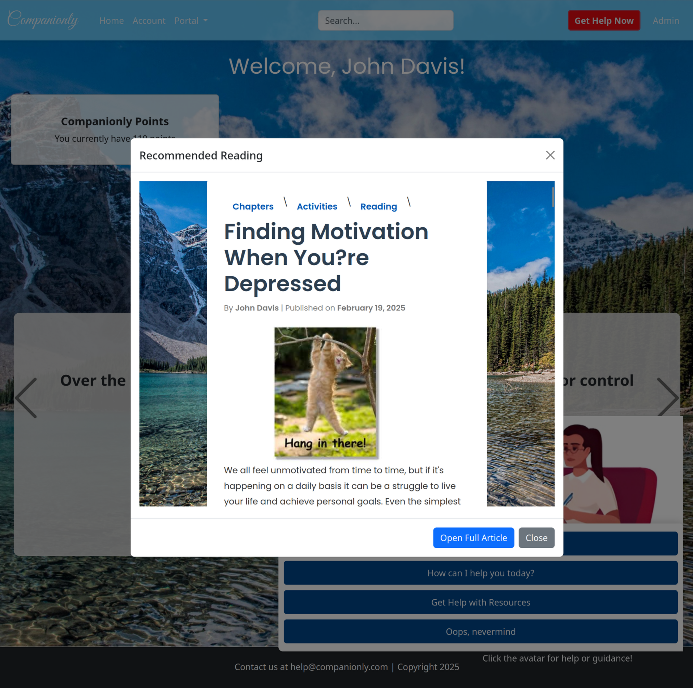
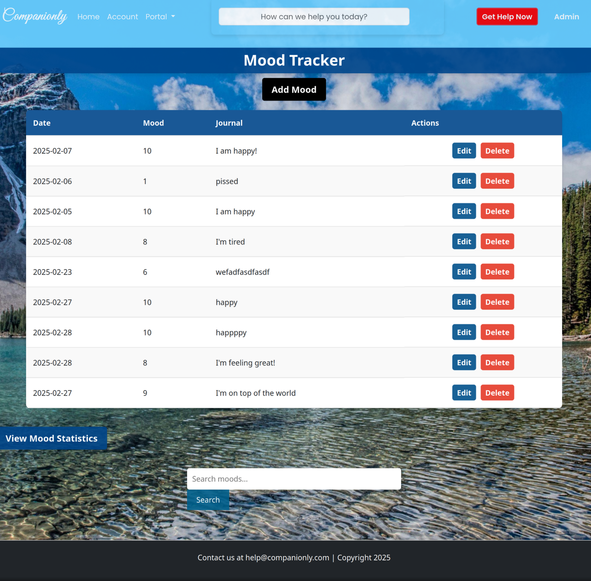

# **Companionly**

## 🌐 [Live App](https://awesome-chess-447016-v7.wl.r.appspot.com/)

  

---

## 📖 **Introduction**
**Companionly** is a **user-friendly, evidence-based platform** designed to support mental well-being. It provides **interactive tools, guided activities, and real-time chat support** to help users manage stress, anxiety, and depression.

### 🔹 **Key Features**  
✔ **Personalized Mood Tracking** – Users receive tailored resources based on a guided questionnaire.  
✔ **Mindfulness Exercises** – Guided breathing techniques and meditation activities.  
✔ **Community Chat** – A secure space for real-time discussions with other users.  
✔ **Resource Library** – Curated articles and self-help materials on mental health topics.  
✔ **Crisis Support** – Instant access to emergency contacts and professional help.  
✔ **Gamification & Rewards** – A **point-based system** encourages engagement and learning.  

---

## 🔍 **Background & Motivation**
Mental health disorders such as **stress, anxiety, and depression** affect millions worldwide, yet access to therapy and professional guidance remains limited. Mobile apps provide **immediate, scalable solutions** that empower users to take control of their well-being.

### **Companionly was built to:**  
✅ **Break down barriers** to mental health support.  
✅ **Provide accessible, evidence-based resources.**  
✅ **Encourage peer engagement** in a **safe digital space.**  

By leveraging **Spring Boot, Thymeleaf, WebSockets, and Google Cloud**, Companionly integrates multiple support systems into a single, user-friendly application.

---

## 🛠 **Technology Stack & Methods**
Companionly is developed using modern web technologies to ensure **scalability, security, and ease of use**.

### **Tech Stack**
- **Backend:** Spring Boot (Java), Spring WebSockets, Spring Security, JPA (Hibernate)
- **Frontend:** Thymeleaf, Bootstrap, JavaScript (SockJS & STOMP)
- **Database:** MySQL (JPA/Hibernate ORM)
- **Deployment:** Google Cloud Platform (App Engine)

### **Core Features & Implementation**
✅ **Mood Tracker:**  
- Users complete a questionnaire, and responses are stored in a database.  
- The system calculates a **total score** to determine **recommended articles & activities**.  
- If the score exceeds a threshold (e.g., 9+), **a pop-up suggests relevant resources.**  

✅ **Live Chat (Real-Time WebSockets):**  
- Implemented using **Spring WebSockets and STOMP**.  
- Allows users to send and receive messages instantly.  
- Includes **user join/leave notifications**.  

✅ **Resource Library:**  
- Structured as **broad topics → chapters → articles.**  
- Covers stress, anxiety, depression, and coping strategies.  
- Searchable and dynamically expandable.  

✅ **Community Forum:**  
- Users can engage in peer discussions in **a safe, moderated environment**.  
- Integrated with a **secure authentication system**.  

✅ **Crisis Support & Emergency Resources:**  
- Quick access to emergency contacts.  
- Displays **mental health hotline numbers based on location.**  

---

## 💬 **Challenges & Learnings**
- Merging multiple modular applications into a **larger app** resulted in **unexpected bugs** and required extensive debugging.
- Features that **worked well locally** behaved differently when **deployed on Google Cloud**, requiring **adjustments and optimizations**.

---

## 📊 **Results & Achievements**
- Successfully implemented **real-time chat, mood tracking, and crisis support**.  
- Developed a **scalable, modular architecture** to allow **future expansion.**  
- Deployed the app on **Google Cloud** for accessibility and reliability.  

### **Screenshots**

  

  

  

  

---

## 🏆 **Conclusion & Future Enhancements**
Companionly is an **accessible, secure, and evidence-based** mental health platform designed to **empower users with knowledge and support.**  

### 🚀 **Planned Future Features**  
✅ **Multilingual Support** – Expanding accessibility for a **global audience**.  
✅ **Professional Integration** – Connecting users with **licensed mental health professionals**.  
✅ **AI-Powered Recommendations** – Personalized **article/activity suggestions** based on user data.  
✅ **Advanced Forum Features** – **Anonymous posting & private group chats.**  

Despite deployment challenges, Companionly is now **feature-complete, scalable, and ready for real-world use.** 🎉  

---

## 🎥 **Demo of Application**

---

## 📚 **References**
1. Rajeev, A. (2021). *Build a Spring Boot chat app with TalkJS.* TalkJS.  
   🔗 [Read Here](https://talkjs.com/resources/how-to-add-chat-into-a-spring-boot-app/)

2. Plkpiotr. (2017). *GitHub - plkpiotr/forum: Internet forum powered by Spring Framework and MySQL.* GitHub.  
   🔗 [GitHub Repository](https://github.com/plkpiotr/forum)

3. Programming w/ Professor Sluiter. (2022). *Your First Spring Boot Application.* YouTube.  
   🎥 [Watch Here](https://www.youtube.com/watch?v=uO64p4kQcSk)

---

### 🔗 **Need Help?**  
If you encounter any issues, feel free to **open an issue on GitHub**!  

🚀 **Developed with Spring Boot & Thymeleaf | Hosted on Google Cloud**  
